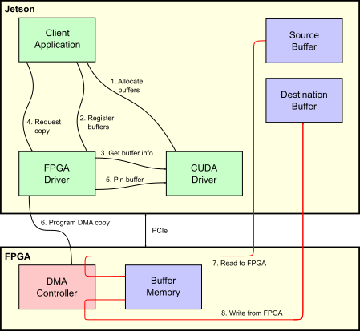

# Introduction

This repository provides a minimal hardware-based demonstration of GPUDirect
RDMA. This feature allows a PCIe device to directly access CUDA memory, thus
allowing zero-copy sharing of data between CUDA and a PCIe device.

The code supports:
* NVIDIA Jetson AGX Xavier (Jetson) running Linux for Tegra (L4T).
* NVIDIA Drive AGX Xavier running Embedded Linux.
* A PC running the NVIDIA CUDA drivers and containing a Quadro or Tesla GPU.

A graphical representation of the system configuration created by the software
in this repository, and the data flow between components, is shown below:



# PCIe Device

## Obtaining the Hardware

This project uses an FPGA as the PCIe device which accesses CUDA memory. The
following FPGA boards are supported:

* RHS Research PicoEVB.
* HiTech Global HTG-K800.

The following sections detail how to obtain and program each board.

### RHS Research PicoEVB

#### FPGA Board

PicoEVB is an M.2 form-factor FPGA board which attaches to the host's PCIe
bus for application data transfer, and is programmed via the M.2 connector's
USB bus. It is available from:

* [picoevb.com](https://picoevb.com/).
* [Amazon](https://amazon.com/); search for ASIN "B0779PC8S4" or "PicoEVB".

#### PCIe Adapter Board

The PicoEVB board is a double-sided M.2 device. Jetson physically only supports
boards with a full-size PCIe connector, or single-sided M.2 devices. PCs
typically only support boards with a full-size PCIe connector. Some form of
adapter is required to connect the two in a mechanically reliable way.

A PCIe x16/x8/x4/x2/x1 to M.2 key E adapter may be used to plug the PicoEVB
board into a full-size PCIe slot on Jetson or a PC. One such adapter board may
be available from Amazon as ASIN B013U4401W, product name "Sourcingbay
M.2(NGFF) Wireless Card to PCI-e 1X Adapter".

The following pair of adapters may be used to connect the PicoEVB board to
Jetson's M.2 key E connector:

* M.2 2230 key E to Mini-PCIe adapter with cable. This may be available from
  Amazon as ASIN B07JFYSNVL, product name "M.2 (NGFF) Key A/E/A+E to Mini
  PCI-E Adapter with FFC Cable". Alternatively, this may be available from
  Amazon as ASIN B00JSBPF70, product name "Bplus: P15S-P15F, M.2 (NGFF) to
  mPCIe Extender Board".
* Mini-PCIe to M.2 2230 adapter board. This may be available from Amazon as
  ASIN B07D4FCD1K, product name "HLT M.2 (NGFF) to mPCIe (PCIe+USB) Adapter".

The following adapter may be used to connect the PicoEVB board to Drive AGX
Xavier's M.2 key M connector:

* M.2 KEY-M interface to M.2 KEY A-E or KEY E interface adapter. This may be
  available from AliExpress with product name as "M.2 Wifi Adapter M.2 M Key
  to A+E Key Slot Wifi Bluetooth Network Card NGFF NVMe PCI express SSD Port
  to E key Slot Wifi Adapter".

The set of available adapters and vendors is very variable over time. Some
searching may be required to locate suitable adapters, from either Amazon or
alternative websites.

### HiTech Global HTG-K800

#### FPGA Board

HTG-K800 is a full-size x16 PCIe card. This will fit directly into the full-
size PCIe connector on Jetson or a desktop PC. For more information, see:
http://www.hitechglobal.com/Boards/Kintex-UltraScale.htm

This project supports the XCKU-60 FPGA, although this should be easy to
change simply by changing the FPGA project properties and re-synthesizing the
provided Vivado project.

#### JTAG Programmer

You will need a Xilinx Platform Cable USB II to program the FPGA. For more
information, see:
https://www.xilinx.com/products/boards-and-kits/hw-usb-ii-g.html

## Obtaining FPGA Programming Software

### Xilinx Vivado Design Suite

This software must run on an x86 Linux PC.

Xilinx Vivado is used to compile the FPGA bitstream, and to program the
bitstream into the FPGA. The free "WebPACK Edition" is sufficient.
Obtain this software from [the Xilinx website](https://www.xilinx.com/).

The PicoEVB project requires Vivado 2018.3.

The HTG-K800 project requires Vivado 2018.1.

Newer versions of Vivado should be able to import these projects.

### xvcd

This software is only required for the PicoEVB board; the HTG-K800 board does
not need it.

This software must run on the system that the PicoEVB FPGA card is plugged
into. This may be either an x86 Linux PC, or a Jetson system.

Note that Drive AGX Xavier's M.2 slot does support USB. Consequently, it is not
possible to program the FPGA when attached to this connector. The PicoEVB board
can be programmed on Linux PC or Jetson system instead, then connected to Drive
AGX Xavier once programmed.

Vivado relies upon a piece of software known as xvcd (Xilinx Virtual Cable
Daemon) to communicate with the PicoEVB board for programming purposes.
Obtain it from [github.com](https://github.com/RHSResearchLLC/xvcd). Execute
the commands below to download and compile the software:

```
sudo apt update
sudo apt install build-essential libftdi-dev
git clone https://github.com/RHSResearchLLC/xvcd.git
cd xvcd/
cd linux/src
make
```

## Generating the Bitstream

In the following text, `fpga-*/` refers to the FPGA project sub-directory. For
PicoEVB, this is `fpga-picoevb/`, and for the HTG-K800, this is
`fpga-htg-k800/`.

A pre-compiled bitstream is provided in this project; `fpga-*/*.mcs.bz2`. It is
not necessary to regenerate the bitstream. However, if you wish to do so,
follow these steps:

1. Open a shell prompt, and `cd` to the `fpga-*/` directory in this project.
2. Execute `./git-to-project.sh` to generate the Vivado project files. You may
   have to adjust the `vivado` variable in this script if the `vivado`
   executable is not in your `$PATH`, or the expected installation location.
3. Execute `./synthesize-fpga.sh` to synthesize and implement the FPGA. This
   will generate the FPGA bitstream. Alternatively, you may perform this step
   by opening `fpga-*/vivado-project/vivado-project.xpr` using the Vivado GUI,
   and requesting that it perform bitstream generation. Either way, this
   process will take from 5-60 minutes depending on the speed of your PC, and
   which FPGA project you're building.
4. Execute `./generate-cfgmem.sh` to generate the configuration memory image.

If you make modifications to the Vivado project, or any files or IP blocks it
contains or uses, and wish to commit those changes into source control, execute
`./project-to-git.sh` to regenerate the checked-in files `git-to-project.tcl`
and `git-to-ips.tcl`.

## Programming the FPGA

### RHS Research PicoEVB

Programming the FPGA requires Vivado installed on an x86 Linux PC, and xvcd
running on the system that contains the PicoEVB board.

If you run xvcd on Jetson, you must allow network connections from Vivado on
your x86 Linux PC to xvcd running on Jetson. The simplest way to do this is to
use `ssh`'s port-forwarding feature; on the x86 Linux PC, execute:

`ssh -L 2542:127.0.0.1:2542 ip_address_of_jetson`

To run xvcd, on the system containing the FPGA card, execute:

`sudo ./xvcd -P 0x6015`

On your x86 Linux PC, open a shell prompt, `cd` to the `fpga-*/` directory in
this project, and execute:

`program-fpga.sh`

The process of connecting Vivado's programming tools to the FPGA can be
unreliable. If the connection attempt fails, and the script exits without
programming the FPGA, you will need to execute the command again.

The programming process will take from 20 to 40 minutes. The programming
process generates no output for most of its operation, so may appear to have
hung, but is actually running.

### HiTech Global HTG-K800

Programming the FPGA requires Vivado installed on an x86 Linux PC with the
Xilinx platform cable attached.

On your x86 Linux PC, open a shell prompt, `cd` to the `fpga-*/` directory in
this project, and execute:

`program-fpga.sh`

The programming process will take a few minutes. The programming process
generates no output for most of its operation, so may appear to have hung,
but is actually running.

# Linux Kernel Driver

## Building on Jetson/Drive AGX Xavier, to Run on Jetson/Drive AGX Xavier

To build the Linux kernel driver, execute:

```
sudo apt update
sudo apt install build-essential bc
cd /path/to/this/project/kernel-module/
./build-for-jetson-drive-igpu-native.sh
```

This will generate `picoevb-rdma.ko`.

## Building on an x86 Linux PC, to Run on Jetson/Drive AGX Xavier

The Linux kernel driver may alternatively be built (cross-compiled) on an x86
Linux PC. You will first need to obtain a copy of the "Linux headers" or
"kernel external module build tree" files from L4T; these may be found in
`/usr/src/` on Jetson/Drive AGX Xavier, or obtained from the L4T/Drive
downloads website.

To build the Linux kernel driver on a x86 Linux PC, execute:

```
sudo apt update
sudo apt install build-essential bc
cd /path/to/this/project/kernel-module/
# Adjust the KDIR value to match the exact path in your copy of the
# kernel headers
KDIR=/path/to/linux-headers-4.9.140-tegra-linux_x86_64/kernel-4.9/ ./build-for-jetson-drive-igpu-on-pc.sh
```

This will generate `picoevb-rdma.ko`. This file must be copied to Jetson/Drive
AGX Xavier.

## Building on an x86 Linux PC, to Run on That PC

```
sudo apt update
sudo apt install build-essential bc
cd /path/to/this/project/kernel-module/
./build-for-pc-native.sh
```

This will generate `picoevb-rdma.ko`.

## Loading the Module

To load the kernel module, execute:

```
sudo insmod ./picoevb-rdma.ko
```

Once the module is loaded, executing `lspci -v` should show that the module is
in use as the kernel driver for the FPGA board:

```
$ lspci -v
...
0003:01:00.0 Memory controller: NVIDIA Corporation Device 0001
	Subsystem: NVIDIA Corporation Device 0001
	Flags: bus master, fast devsel, latency 0, IRQ 36
	Memory at 34210000 (32-bit, non-prefetchable) [size=4K]
	Memory at 34200000 (32-bit, non-prefetchable) [size=64K]
	Capabilities: <access denied>
	Kernel driver in use: picoevb-rdma
```

# User-space Applications

## Building on Jetson/Drive AGX Xavier, to Run on Jetson/Drive AGX Xavier

The client applications are best built on Jetson/Drive AGX Xavier itself. Make
sure you have the CUDA development tools installed, and execute:

```
sudo apt update
sudo apt install build-essential bc
cd /path/to/this/project/client-applications/
./build-for-jetson-drive-igpu-native.sh
```

## Building on an x86 Linux PC, to Run on Jetson/Drive AGX Xavier

Building (cross-compiling) the client applications on a x86 Linux PC is only
partially supported; the makefile does not yet support cross-compiling the CUDA
test application. However, the other applications may be cross-compiled by
executing:

```
sudo apt update
sudo apt install build-essential bc
cd /path/to/this/project/client-applications/
./build-for-jetson-drive-igpu-on-pc.sh
```

You may need to adjust the value of variable `CROSS_COMPILE` in script
`./build-for-jetson-drive-igpu-on-pc.sh` to match the configuration of your x86
Linux PC.

## Building on an x86 Linux PC, to Run on That PC

Make sure you have the CUDA development tools installed, and execute:

```
sudo apt update
sudo apt install build-essential bc
cd /path/to/this/project/client-applications/
./build-for-pc-native.sh
```

## Running the Tests

### Data Access Tests

Two PCIe data access tests are provided; `rdma-malloc` and `rdma-cuda`. Both
tests are structurally identical, but allocate memory using different APIs; the
former using `malloc()`, and the latter via `cudaHostAlloc()` (Jetson/Drive AGX
Xavier) or `cudaMalloc()` (PC).

Both tests proceed as following:

1. Allocate source and destination memory.
2. In the CUDA case, prepare the memory for RDMA by calling
   `cuPointerSetAttribute(CU_POINTER_ATTRIBUTE_SYNC_MEMOPS)` and pinning it.
3. Fill the source surface with a known pattern.
4. Fill the destination surface with different values.
5. Use the FPGA to copy the source to the destination surface.
6. Validate that the data was correctly copied.

To run the tests, execute:

```
sudo ./rdma-malloc
sudo ./rdma-cuda
```

You can avoid the need to use `sudo` by applying appropriate permissions to the
kernel driver's device file, `/dev/picoevb`.

Internally to the kernel driver, the copy operation divides the surface into
64KiB chunks (or smaller, depending on memory alignment), and for each chunk
first copies that chunk's data from the source surface to the FPGA's internal
memory, then copies the data from the FPGA's internal memory to the destination
surface. This demonstrates both PCIe read and write access to CUDA GPU memory.
The requirement to divide the data into chunks is a limitation of the internal
memory size of the PicoEVB board's FPGA, and likely would not apply in a
production device.

Separate test applications exist to exercise the uni-directional copy feature
of the kernel driver, and to report transfer performance. Two versions of the
tests exist; one using `malloc()`'d memory on the host, and the other using
memory allocated via CUDA. To run these tests, execute:

```
sudo ./rdma-malloc-h2c-perf
sudo ./rdma-malloc-c2h-perf
sudo ./rdma-cuda-h2c-perf
sudo ./rdma-cuda-c2h-perf
```

### set-leds

This test sets the values of the three LEDs on the PicoEVB. It accepts a single
command-line parameter indicating the binary value to display on those LEDs.
The hardware inverts this value, so a parameter value of `0` turns on all LEDS,
and a parameter value of `7` turns off all LEDs. For example:

```
./set-leds 2
./set-leds 5
```
